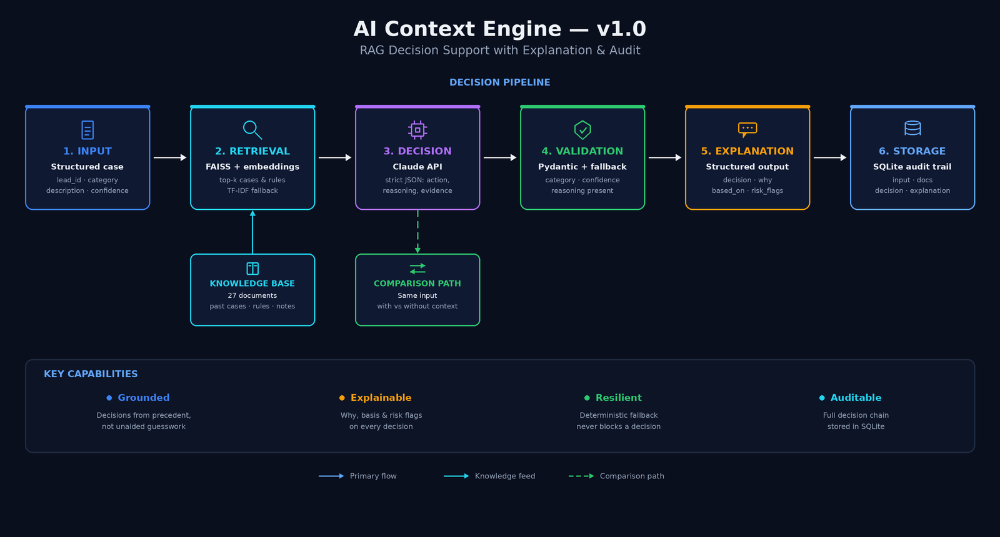

# AI Context Engine (RAG Decision Support) — v1.0

## Problem

An AI model can output a category and a confidence score. What it
cannot do on its own is show what the decision was based on,
remember how similar cases were handled before, or leave a record
you can audit later. In operations, a decision you can't explain is
a decision you can't trust, defend, or improve. When a recommendation
is questioned weeks later, "the model said so" is not an answer.

Most RAG demos stop at answering questions. This system uses
retrieval to support and explain an operational decision.

## Solution

A retrieval-grounded decision support layer. For each incoming case
it retrieves relevant past cases and rules from a knowledge base,
asks the model for a decision grounded in that context, validates the
output, produces a structured explanation with risk flags, and writes
the full chain to an audit trail.

**This is not a chatbot or a Q&A system.** It is a decision support
system with memory and explainability — every recommendation is
fully traceable, and grounded in retrieved precedent when the LLM
layer is active.

**Who this is for:** Teams using AI for operational decisions — lead
qualification, case routing, triage — where the decision has to be
explainable, grounded in precedent, and auditable.

## Why Not Just Call the Model Directly?

A direct model call has no memory of past cases and no traceable basis
for its answer. Rules-based systems can't handle ambiguous cases at
all. This system adds the layer both are missing: institutional memory
through retrieval, and an explanation + audit layer that makes each
decision defensible after the fact.

## Outcome

Built against a 27-document knowledge base (past cases, decision
rules, operational notes) and a 75-record evaluation set covering
correct, incorrect, and ambiguous decisions. Verification is a
committed, runnable artifact, not a claim: `run_eval.py` posts all 75
records to the live server and gates the result against thresholds
fixed in `eval_config.py` before any run happened. The fallback-mode
run scored 68/75 — see [EVAL_RESULTS.md](EVAL_RESULTS.md) for the
full output, the named misses, and its limitations.

- Retrieval always runs and every retrieved document is persisted;
  decisions are grounded in that context only when the LLM layer is
  active (a real API key configured). In the default, out-of-box
  fallback mode, the system says so on every single response —
  `context_was_used: false` plus an explicit risk flag — rather than
  silently claiming a grounding it didn't do. See
  [Known Limitations](#known-limitations)
- A with/without-context comparison path runs the same input through
  both grounded and ungrounded decisions, making the effect of
  retrieval visible on demand
- Validation + deterministic fallback: a malformed or failed model
  response never blocks a decision or corrupts the record
- Full chain — input, retrieved documents, decision, explanation —
  persisted to SQLite for cross-run audit

## Installation

```bash
git clone https://github.com/kobescak-kristian/ai-context-engine
cd ai-context-engine
python -m venv .venv && source .venv/bin/activate   # Windows: .venv\Scripts\activate
pip install -r requirements.txt
cp .env.example .env   # then add your ANTHROPIC_API_KEY if you have one
```

**Without an API key** the system runs in deterministic fallback mode — retrieval,
validation, explanation, and audit trail all work, but the decision itself is made by
rule-based routing on the input fields only (`confidence`, `category`); the retrieved
context is stored and shown in the response, but it does not influence the decision in
this mode (`context_was_used: false`). This is the configuration this README's own
Quick Start produces. See [Known Limitations](#known-limitations).

**With semantic vector retrieval (optional):** install `sentence-transformers` for
higher-quality retrieval. Without it the system falls back to TF-IDF automatically:

```bash
pip install sentence-transformers
```

## Quick Start

**Shell:** the commands below use bash syntax (Git Bash, WSL, or macOS/Linux
Terminal). On Windows PowerShell, `curl` is aliased to `Invoke-WebRequest`,
which does not accept these arguments and will fail with a parameter-binding
error — use `curl.exe` in place of `curl`, or run these commands in Git Bash.

```bash
# Start the API server
uvicorn app:app --reload --port 8000

# Run a case through the full pipeline
curl -X POST http://localhost:8000/decision-support \
  -H "Content-Type: application/json" \
  -d '{
    "lead_id": "LEAD-001",
    "category": "high_value",
    "description": "Enterprise SaaS company, 700 employees, CTO requested demo and pricing.",
    "confidence": 0.84
  }'

# Compare with vs without RAG context
curl -X POST http://localhost:8000/decision-support/compare \
  -H "Content-Type: application/json" \
  -d '{"lead_id": "LEAD-001", "category": "high_value",
       "description": "Enterprise SaaS, CTO contact, clear buying intent.", "confidence": 0.84}'

# Retrieve stored decisions
curl http://localhost:8000/explanations

# Interactive API docs — open in your browser:
# http://localhost:8000/docs
```

## Architecture



## System Flow

1. **Input** — structured case received and validated
   (`lead_id`, `category`, `description`, `confidence`)
2. **Retrieval (RAG)** — FAISS search over the knowledge base returns
   the most relevant past cases and rules; uses sentence-transformers
   embeddings when available, falls back to TF-IDF automatically, so
   the system runs anywhere without requiring the embedding model
3. **Decision support** — the model receives the input plus retrieved
   context and returns strict JSON: `recommended_action`, `reasoning`,
   `supporting_evidence`, `confidence_adjusted`
4. **Validation** — Pydantic checks category validity, confidence
   range, and that reasoning is present; a deterministic fallback
   handles any failure
5. **Explanation** — a structured explanation is produced: `decision`,
   `why`, `based_on`, `risk_flags`
6. **Storage** — input, retrieved documents, decision, and explanation
   are written to SQLite (with a normalised retrievals table) for a
   complete audit trail

## Business Value

| Component | What it enables |
|---|---|
| Vector retrieval (FAISS) | Decisions grounded in past cases, not made in isolation |
| TF-IDF fallback | System runs without heavy dependencies — portable demo and deployment |
| Decision support layer | Structured, consistent recommendations instead of free-form text |
| Pydantic validation | Invalid model output never becomes an operational decision |
| Deterministic fallback | A model failure degrades gracefully instead of breaking the flow |
| Explanation layer | Every decision carries its reasoning, basis, and risk flags |
| SQLite audit trail | Any past decision can be reconstructed and defended later |
| With/without-context comparison | The value of retrieval grounding is measurable, not assumed |

## API Endpoints

| Endpoint | Purpose |
|---|---|
| `POST /decision-support` | Run a case through the full retrieval → decision → explanation pipeline |
| `POST /decision-support/compare` | Run the same case with and without RAG context; returns both decisions side by side |
| `GET /explanations` | Retrieve stored decisions with their explanations |
| `GET /context/{lead_id}` | Inspect the retrieved context behind a specific decision |
| `GET /health` | Service health check |

**Compare persists both legs under a suffixed `lead_id`:** `/decision-support/compare`
stores its two decisions as `{lead_id}-with-context` and `{lead_id}-without-context`
rather than the plain `lead_id`, so they don't collide with each other or with a
plain `/decision-support` run for the same lead. To look up one via `GET
/explanations` or `GET /context/{lead_id}`, use the suffixed ID (e.g.
`LEAD-001-with-context`), not the original.

**Request payload** (`POST /decision-support` and `/compare`):

```json
{
  "lead_id":       "LEAD-001",
  "category":      "high_value",
  "description":   "...",
  "confidence":    0.84,
  "context_query": "(optional) override the retrieval query"
}
```

Valid `category` values: `high_value` · `low_value` · `manual_review` ·
`support_escalation` · `ambiguous` · `disqualified`

## Stack

Python 3.11+ · Pydantic v2 · FAISS · TF-IDF fallback · Claude API
(via httpx) · FastAPI · SQLite · python-dotenv ·
sentence-transformers *(optional — semantic retrieval upgrade)*.
(See `requirements.txt` for exact versions.)

## Key Design Decisions

**Standalone by design:** Reuses proven patterns from the other
engines — Pydantic schemas, validation before action, deterministic
fallback, SQLite audit, structured JSON — but shares no files with
them. It runs entirely on its own.

**Real vector retrieval with a portable fallback:** FAISS +
sentence-transformers gives genuine semantic retrieval; the TF-IDF
fallback means the system still runs on a machine that can't install
or load the embedding model.

**Decision support, not conversation:** Output is strict JSON for a
downstream system to act on — never free-form chat. This is the
difference between a demo and something operations can build on.

**Explanation and audit as first-class layers:** The explanation and
the stored retrieval chain are not add-ons; they are the point. They
are what make the decision trustworthy.

## Known Limitations

**Grounding requires a real API key.** In fallback mode — the mode this repo's own
Quick Start produces — decisions come from deterministic rule-based routing on
`confidence` and `category` only; the retrieved context is not what the decision is
based on, even though it is retrieved and stored. If you ran the quickstart and every
response says `context_was_used: false`, that is not a bug: the "grounded in retrieved
context" outcome claim above describes the LLM-active path, which requires a configured
`ANTHROPIC_API_KEY` and has not been recorded end-to-end in this repo at the time of
writing.

**Retrieval quality is bounded by the knowledge base** — no embedding
fine-tuning; quality scales with the size and quality of the stored
cases.

**Synthetic data** — the knowledge base and evaluation set are
generated, not real client data.

**No API authentication** — endpoints are open; production requires
auth middleware.

**SQLite** — single-node persistence. Production upgrade: PostgreSQL
with a managed vector store.

*Production path: managed vector database · embedding tuning on real
cases · API authentication · PostgreSQL.*

## Version Log

| Version | Date | Change |
|---|---|---|
| v1.0 | 2026-06-20 | Initial complete release — see [Outcome](#outcome) |

## Repository Structure

```
ai-context-engine/
├── adr/                     # Architecture decision records (Tier 0)
├── .githooks/               # Pre-push validation (ARTIFACT_STANDARD check)
├── app.py                   # FastAPI app and endpoint definitions
├── pipeline.py              # Orchestrator — runs all layers in sequence
├── engine.py                # RAG retrieval layer (FAISS + TF-IDF fallback)
├── validator.py             # Pydantic validation + deterministic fallback
├── explainer.py             # Structured explanation generation
├── db.py                    # SQLite storage (decisions + retrievals tables)
├── schemas.py               # Pydantic data models
├── support.py               # LLM decision support layer
├── dataset_generator.py     # Synthetic knowledge base and eval set generator
├── knowledge_base.json      # 27 documents — past cases, decision rules, notes
├── eval_dataset.json        # 75 records — correct / incorrect / ambiguous
├── run_eval.py              # Eval harness — posts eval_dataset.json to the live server
├── eval_config.py           # Eval gate thresholds (committed before the first run)
├── EVAL_RESULTS.md          # Committed eval run output
├── EXAMPLE_OUTPUTS.md       # Sample pipeline outputs
├── ai-context-engine_architecture.png  # Architecture diagram (see Architecture section)
├── CLAUDE.md                # ARTIFACT_STANDARD project instructions
├── README.md                # This file
├── .env.example             # Environment variable template
└── requirements.txt
```

**Eval dataset:** `eval_dataset.json` contains 75 labelled records
(25 correct · 25 incorrect · 25 ambiguous). `run_eval.py` posts all 75 to the live
`/decision-support` endpoint, checks `recommended_action` against `expected_action`,
and gates the result against the thresholds in `eval_config.py`. See
[EVAL_RESULTS.md](EVAL_RESULTS.md) for the committed run.

## System Context

Part of a five-engine AI decision system:

- **[AI Reliability Engine](https://github.com/kobescak-kristian/ai-reliability-engine)** - prevents invalid AI outputs from entering workflows
- **[AI Decision Engine](https://github.com/kobescak-kristian/ai-decision-engine)** - tracks outcomes and evaluates whether decisions were correct
- **[AI Impact Scoring Engine](https://github.com/kobescak-kristian/ai-impact-scoring-engine)** - measures the financial impact of decisions and tunes thresholds
- **[AI Execution Engine](https://github.com/kobescak-kristian/ai-execution-engine)** - executes the workflow and recommends improvements
- **AI Context Engine** - grounds decisions in retrieved precedent and explains them *(this system)*

Complete system: validation → evaluation → financial impact → grounded explanation → execution